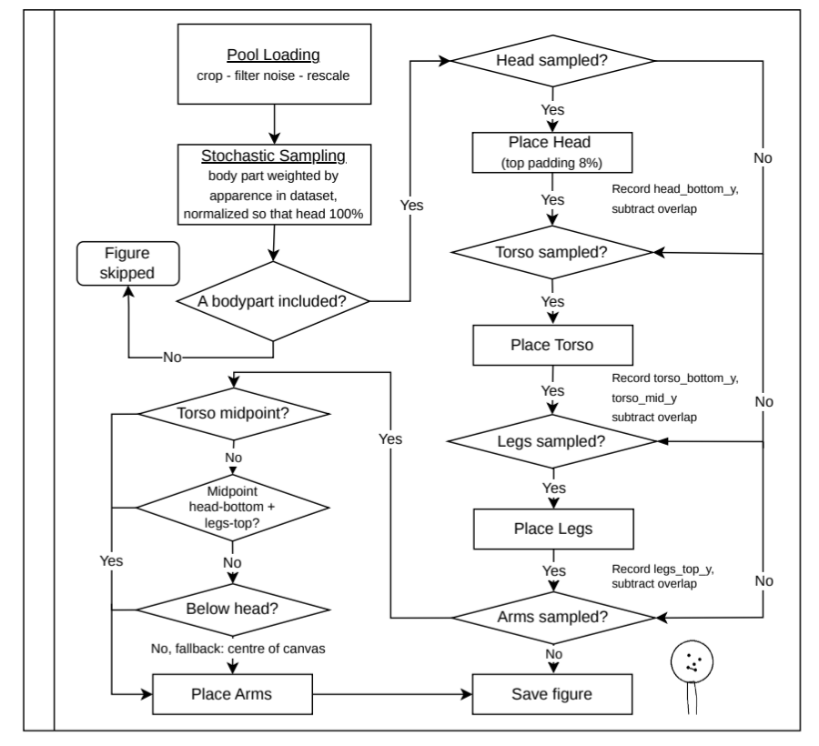

# Assemble Pose
---

## Pipeline Overview

`assemble_pose_figures.py` is the second stage of the pipeline. It consumes the region-specific skeleton images produced by the extraction script and recombines randomly sampled body parts into synthetic stick figures.

---

## Input

- The **output folder** produced by the extraction pipeline, containing `head/`, `torso/`, `arms/`, and `legs/` subdirectories of transparent PNG skeleton images.
- The **same CSV ratings file** used during extraction, which controls which parts are eligible for inclusion.

## Processing Steps

**1. Pool Loading**
All eligible part images are loaded from their respective subdirectories. Each image is read, converted to grayscale (or extracted from the alpha channel if RGBA), and tightly cropped to remove the blank canvas surrounding the skeleton lines. Parts that fail the crop — either blank, implausibly dense (>25% of the bounding box is dark, indicating noise or artefacts rather than sparse line work), or covering nearly the entire original frame — are discarded. The number of valid entries per part and their frequency relative to the total dataset are reported.

**2. Proportion Computation**
Target rendering dimensions for each body part are derived from the **median cropped size** across all pool entries. The combined height of head, torso, and legs is scaled to occupy approximately 85% of the canvas height. Arm and torso widths are additionally capped as a fraction of canvas width to prevent disproportionately wide parts, with aspect ratio preserved.

**3. Figure Assembly**
Each figure is built on a square black canvas through the following steps:

- **Stochastic part inclusion** — each part is included with a probability proportional to its normalised frequency in the collected dataset. 

- **Stacking** — head, torso, and legs are placed top-to-bottom with a configurable overlap (default 6% of part height) so that joints connect visually across part boundaries. Arms are overlaid horizontally centred, with vertical position determined by the best available reference in priority order: torso midpoint → midpoint between head-bottom and legs-top → canvas centre.
- **Pixel blending** — parts are composited onto the canvas using a bitwise AND, so overlapping skeleton lines from adjacent parts are both preserved.

Each successfully assembled figure is saved as a grayscale PNG to a `figures/` directory. Figures where the pool is too sparse to assemble any parts are skipped and reported.

#### CLI Parameters

| Argument | Description | Default |
|---|---|---|
| `--output_folder` | Extraction pipeline output directory | *(required)* |
| `--csv` | CSV ratings file for good visible parts| *(required)* |
| `--csv_all` | CSV ratings  file for all frames (used for frequency calculation)| *(required)* |
| `--count` | Number of figures to generate | `20` |
| `--size` | Canvas size in pixels (square) | `512` |
| `--overlap` | Joint overlap as fraction of part height | `0.06` |
| `--seed` | Random seed for reproducibility | `None` |
