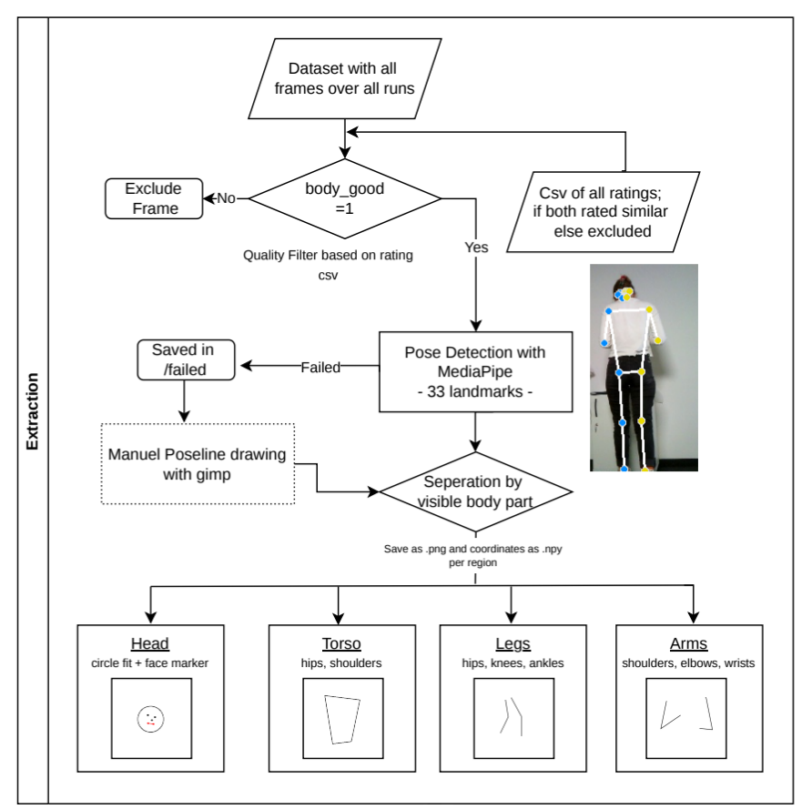

# Extract Pose 

---

## Pipeline Overview



This script implements a processing pipeline for extracting and visualising human body pose landmarks from images using [Google's MediaPipe Pose Landmarker](https://ai.google.dev/edge/mediapipe/solutions/vision/pose_landmarker).

---

## Preparation

Images are pre-annotated with quality ratings via a CSV file. Only images marked as having good overall body visibility (`body_good = 1`) are processed. Per-region extraction is further gated by individual region visibility flags.

The MediaPipe PoseLandmarker model file (pose_landmarker.task) must be downloaded separately and placed in the working directory or passed via --model. 

```bash
wget https://storage.googleapis.com/mediapipe-models/pose_landmarker/pose_landmarker_heavy/float16/latest/pose_landmarker_heavy.task \
     -O pose_landmarker.task
```

---

#### Processing Steps

**1. Pose Detection**
Each qualifying image is passed to the MediaPipe `PoseLandmarker` model, which returns 33 normalised 3D landmarks covering the full body.

**2. Annotated Image**
A full-body annotated overlay is saved, showing all detected landmarks and skeletal connections drawn over the original image.

**3. Region-Specific Extraction**
The body is divided into four anatomical regions:

- **Head** — A circular outline is fitted around facial landmarks (eyes, ears, nose, mouth) with a configurable padding radius. The circle centre is the mean of head landmark positions; the radius is set to encompass all head landmarks plus padding. Eye and nose landmarks are marked individually; mouth landmarks are connected by a line.
- **Torso** — Skeletal connections between shoulders and hips are drawn.
- **Arms** — Connections spanning shoulder → elbow → wrist for both sides.
- **Legs** — Connections spanning hip → knee → ankle for both sides.

For torso, arms, and legs, landmark connection lines are drawn as black strokes; the white background is then converted to transparency and saved as PNG.

**4. Coordinate Export**
Raw 3D landmark coordinates (x, y, z in pixel space) for each region are saved as `.npy` arrays.

**5. Failure Handling**
Images where pose detection fails are logged and saved to a `failed/` subdirectory for manual review.

---

#### Output Structure

```
output_folder/
├── annotated/   # Full-body landmark overlays
├── head/        # Transparent PNGs with head circle + facial features
├── torso/       # Transparent PNGs with torso connections
├── arms/        # Transparent PNGs with arm connections
├── legs/        # Transparent PNGs with leg connections
├── npy/         # NumPy arrays of landmark coords and head masks
└── failed/      # Images where pose detection produced no landmarks
```

#### CLI Parameters

| Argument | Description | Default |
|---|---|---|
| `--input_folder` | Folder containing input images and CSV | traindata |
| `--output_folder` | Folder where outputs are saved | output_imagees_all |
| `--model` | Path to MediaPipe .task model file | pose_landmarker.task |
| `--head_padding` | Pixel padding added to head circle radius | 20 |
