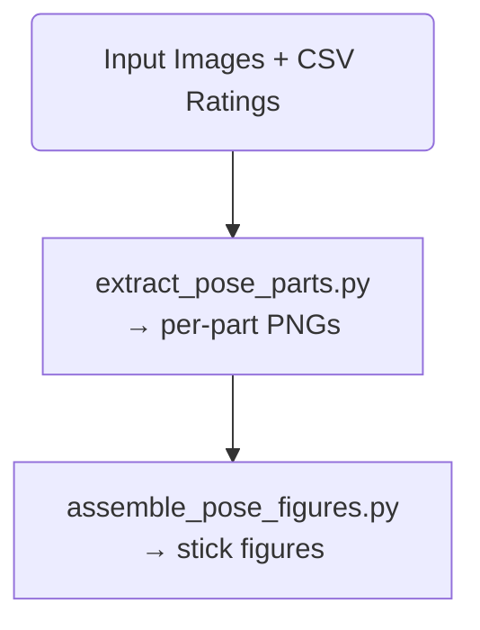

# Tadpole_drawing_pipelie

---

## Pipeline Overview



### More information: 
[Extract Pose Readme](Pipeline/README%20-%20ExtractPose.md) <br>
[Assemble Pose Readme](Pipeline/README%20-%20AssemblePose.md)

---

## Repository Structure
```
├── Data_collection_Nao/
│   ├── nao_attention_capture.py
|   ├── README - AttentionMode.md
│   └── requirements.txt
├── Pipeline/
│   ├── extract_pose_parts.py
│   ├── assemble_pose_figures.py
|   ├── README - AssemblePose.md
|   ├── README - ExtractPose.md
│   └── requirements.txt
└── README.md
```

---

## Requirements

Python 3.9+ is recommended.

The NAO data collection and the pose pipeline have separate dependencies and
should be installed in separate virtual environments. 
If your data collection was done differently, you can only run the pose pipeline. 

```bash
# For Nao code
python -m venv venv_nao
venv_nao\Scripts\activate  # Windows (Command Prompt)
# source venv_nao/bin/activate # Linux/macOS
pip install -r Data_collection_Nao/requirements.txt

# For Pipeline
python -m venv venv_pipeline
venv_pipeline\Scripts\activate  # Windows (Command Prompt)
# source venv_pipeline/bin/activate # Linux/macOS
pip install -r Pipeline/requirements.txt
```

You need the MediaPipe PoseLandmarker model (or whatever model you prefer) file for the Pipeline. 
Download into the `Pipeline/` folder:
```bash
# Using wget (Linux/macOS or Windows with WSL)
wget https://storage.googleapis.com/mediapipe-models/pose_landmarker/pose_landmarker_heavy/float16/latest/pose_landmarker_heavy.task \
     -O Pipeline/pose_landmarker.task

# Using curl (Windows native)
curl -o Pipeline/pose_landmarker.task https://storage.googleapis.com/mediapipe-models/pose_landmarker/pose_landmarker_heavy/float16/latest/pose_landmarker_heavy.task
```

---
## Data Collection (NAO Robot)

For data collection, a NAO robot was operated as a proxy child. The script
`nao_attention_capture.py` runs on your local computer and connects to the
robot remotely over TCP. The robot's camera stream is captured locally and
detection events are logged to CSV.

The attention model uses qi. 

The qi package is included in Data_collection_Nao/requirements.txt. If installation fails via pip, you may need to manually install the Linux wheel

```bash
# Inside venv_nao, Linux/macOS
wget https://github.com/aldebaran/libqi-python/releases/download/qi-python-v3.1.4/qi-3.1.4-cp310-cp310-manylinux_2_17_x86_64.manylinux2014_x86_64.whl
python3.10 -m pip install ./qi-3.1.4-cp310-cp310-manylinux_2_17_x86_64.manylinux2014_x86_64.whl
```

The script implements three attention mechanisms that drive the robot's head
and eye LEDs in response to stimuli. 
See more details in [Nao Robot Attention Mode](./Data_collection_Nao/README%20-%20AttentionMode.md)

### Usage
```bash
python nao_attention_capture.py 
    --ip 192.168.1.X  # required! IP-Adress of your Nao robot (check robot's chest button)
    --session my_session_01 # required! name for this recording session; creates ../data/<session>/ output folder
    --mode all # Attention mode: face | motion | sound | idle | all (all runs all three simultaneously)
    --duration 960 # Recording duration in seconds
    --fps 5.08 # # Camera frames per second; 5.08 is NAO's stable rate for kVGA resolution
    --camera 0 # Camera selection: 0 = top camera, 1 = bottom camera
    --annotation true # Overlay detection labels and bounding boxes on the video (true | false)
```
All outputs are saved to `../data/<session_name>/`
```
<session_name>/
├── video.avi                 ← full session video, re-encoded at measured FPS
├── detection_history.csv     ← one row per detection event per source
└── images/                   ← individual frames as PNG
```

## Usage of the Pipeline

### Step 1 — Extract pose parts
```bash
cd Pipeline
python extract_pose_parts.py 
    --input_folder  traindata  # optional, default traindata: folder containing input images and a single CSV rating file
    --output_folder output_images_all  # optional, default output_images_all
    --model         pose_landmarker.task # need to be downloaded from mediapipe-models
    --head_padding  20 # optional, extra pixels added to head circle radius to ensure full head coverage
```

**Input folder** must contain:
- Image files (`.jpg`, `.jpeg`, `.png`)
- Exactly one `.csv` file with columns: 
  `filename, body_good, head_visible, torso_visible, arms_visible, legs_visible`
  (values `1` = visible / good quality, `0` = skip)

**Output folder** structure:
```
output_images/
├── annotated/   ← full-body landmark overlays
├── head/
├── torso/
├── arms/
├── legs/
├── npy/         ← landmark coordinates as .npy arrays
└── failed/      ← images where no pose was detected, need to be manual marked and moved into corresponding folder
```

---

### Step 2 — Assemble figures
```bash
cd Pipeline
python assemble_pose_figures.py 
    --output_folder output_images # required! set your folder produced by extract_pose_parts.py
    --csv           traindata/ratings.csv # required! set your Path to CSV with visibility ratings for images used in pose extraction
    --csv_all       all_frames/ratings.csv # required! set your Path to CSV with visibility ratings (ALL!)
    --count         100 # optional, default 20: number of figures to generate
    --size          512 # optional, default 512: canvas size in pixels (square)
    --overlap       0.06 # optional, default 0.06: joint overlap as fraction of part height
    --seed          42 # optional, default None, set for reproducibility
```

Generated figures are saved to `./figures/`.

---

## Citation

This code accompanies a manuscript currently under review. If you use this code, please check back for the full citation once published. 
